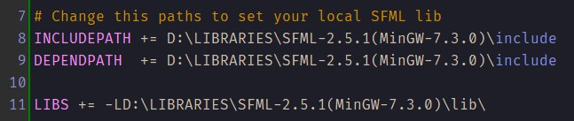

# CrossroadTrafficSFML

## Build and run
First at first you have to install SFML libs. Before that change the following lines in [Qt project file](CrossroadTrafficSFML/CrossroadTrafficSFML.pro). As you can see I used the SFML library which version is 2.5.1 for MinGW Compiler:

Second at second you have to copy content from [Sources floder](Sources/) to the build directions you want to make. Also you have to pull some .dll files up (check the SFML [getting started](https://www.sfml-dev.org/tutorials/2.5/#getting-started) page).

Despite the fact that the SFML libraries built from MinGW-7.3.0 I used MinGW-8.1.0 and it works correctly.

That's all, but if the application is not running, check the compilers and .dll files in the build files.
If you need some questions, tell me about it!